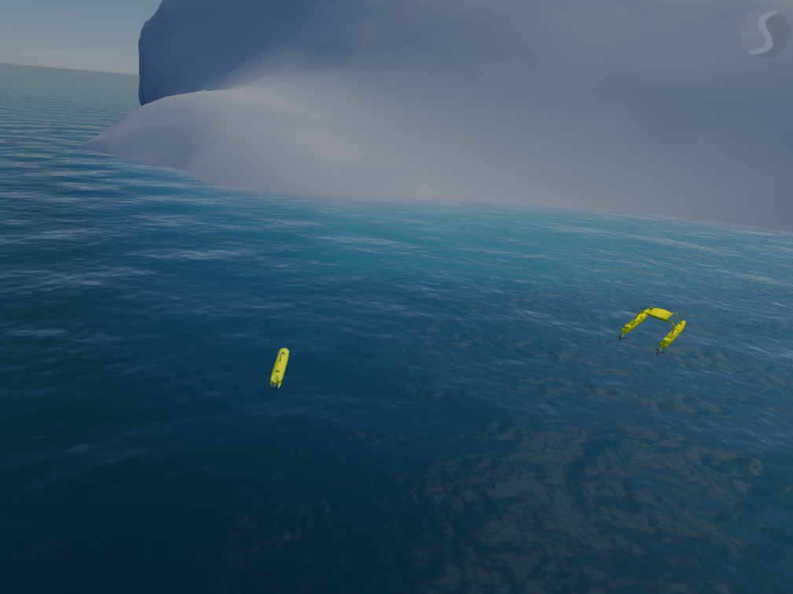

# rise_multirobot
ROS metapackage for wamv and alpha in the stonefish environment

`roslaunch rise_multirobot bringup_simulation` to launch the world

### Dependencies

- [world_of_stonefish](https://github.com/GSO-soslab/world_of_stonefish)
- [wamv_std](https://github.com/GSO-soslab/wamv_std)
- [alpha_rise_auv](https://github.com/GSO-soslab/alpha_rise_auv)
- [msis_pcl](https://github.com/GSO-soslab/msis_pcl)

### Images of the sim environment

